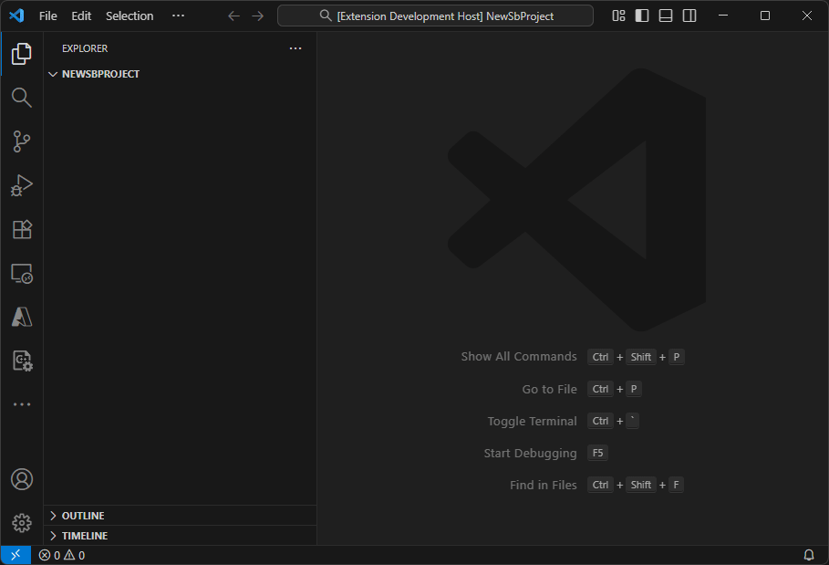

# Streamer.bot C# for Visual Studio Code
Write Streamer.bot C# code with up to date IntelliSense from your Streamer.bot installation.  

## Features
### AutoComplete
Combines autocomplete for standard C# methods with autocomplete for Streamer.bot specific code by referencing your local Streamer.bot installation, ensuring that it does not get out of date.  
  

### Documentation
Loads C# documentation from the Streamer.bot docs repository to provide hovers when you mouse over CPH methods.

### Snippets
Snippets for common actions!  
  
The following snippets are available:  
- `get-global`
- `set-global`
- `get-argument`
- `if-get-argument` (if statement to ensure argument exists)
- `set-argument`
- `log` (Debug, Error, Warn, Info, Verbose)
- `get-random-integer` (in range, inclusive)
- `get-random-double` (between 0 and 1)

### Guided Project Creation
The `New Streamer.bot C# Project` command lets you easily create a new Streamer.bot C# project file with the correct references by automatically detecting Streamer.bot's location if it's pinned to the start menu or taskbar, or by browsing for your current Streamer.bot location  

### New File Creation with Template
Quick creation of new C# files with a starting template when inside a Streamer.bot project directory with the `New Streamer.bot C# File` command, also accessible via `Create: New File...` or the context menu in the Explorer View

### Copy Full File Contents into Streamer.bot
Preprocessor directives allow multiple C# files in the same project without class name conflicts, while still allowing the entire file to be copied into Streamer.bot's editor. 
This is kept minimal by including the Streamer.bot specific usings in the project file instead of each cs file.  

Keep your editor looking clean with automatic folding of the preprocessor directive sections  

## Requirements

Requires the [C# Extension](https://marketplace.visualstudio.com/items?itemName=ms-dotnettools.csharp) for IntelliSense.

## Extension Settings
This extension contributes the following settings:

- `streamer-bot-csharp.autoFold`: Auto-Fold sections of template containing the preprocessor directives
- `streamer-bot-csharp.newFileDir`: Directory into which new C# files will be created

## Acknowledgements
This extension is my attempt to add a layer of convenience to a [fantastic tutorial](https://rondhi.com/docs/cSharpStreamerBot/tutorial/) on using VS Code to write Streamer.bot C#, written by [Rondhi](https://www.twitch.tv/rondhi).

## Known Issues

No current issues.

## Release Notes
### 1.0.0

Initial release of the Streamer.bot C# extension
