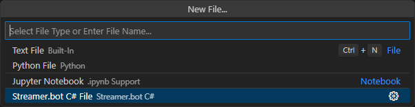
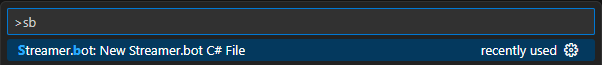
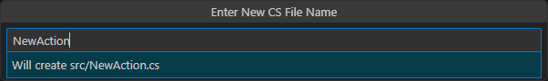

You can create a new Streamer.bot C# file via the "New File"  
  
Or you can call the "New Streamer.bot C# File" command directly  
  

Enter a FileName in PascalCase.  
  
This will automatically create a new file with the `.cs` extension in the default directory  