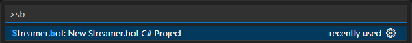
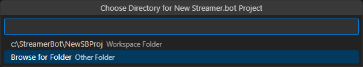
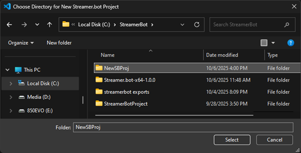
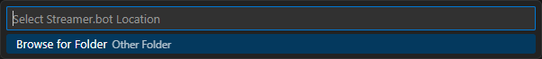
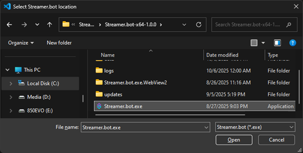

Create a Streamer.bot C# Project Directory to enable creating new Streamer.bot C# Files  
  
Use currently open folder or browse to create new or select existing directory  
  
  
Select Streamer.bot install location  
  
  